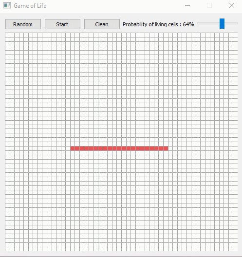

# Simulation Conway's Game of Life

This OOP script was written in Python 3. It's an application which create a simulation of automate cell.
In the application, the red cell are alives and the white cell are dead.

## <ins>Survival Rules</ins>
- If the cell is alive :
    - The cell dies if there are less than 2 neighbors (underpopulation).
    - The cell dies if there are more than 3 neighbors (overpopulaiton).

- If the cell is dead :
    - A new cell born if there are 3 neighbors.

## <ins>Functionalities<ins>
If you click on boxe you can change the state of the cell, so you can create or kill the cell to create a specific pattern.

You can change the initial probability of living random cells.

## <ins>Modules Used</ins>
* Ctypes
* Itertools
* Numpy
* PyQt5

## <ins>How to use ?</ins>
Before running the application, make sure to install the necessary Python libraries with the following command.
```
pip install -r requirements.txt
```
Then, to execute application run the main.py script.
```
python main.py
```


## <ins>Game of Life application.</ins>

